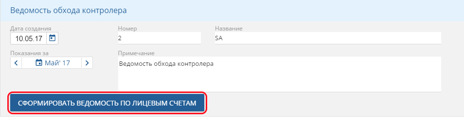
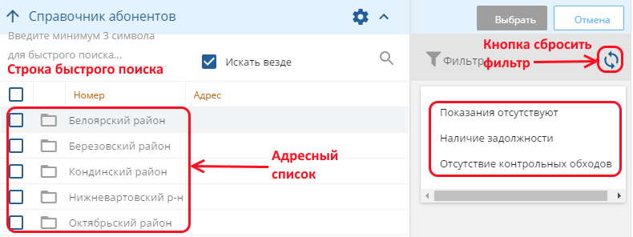
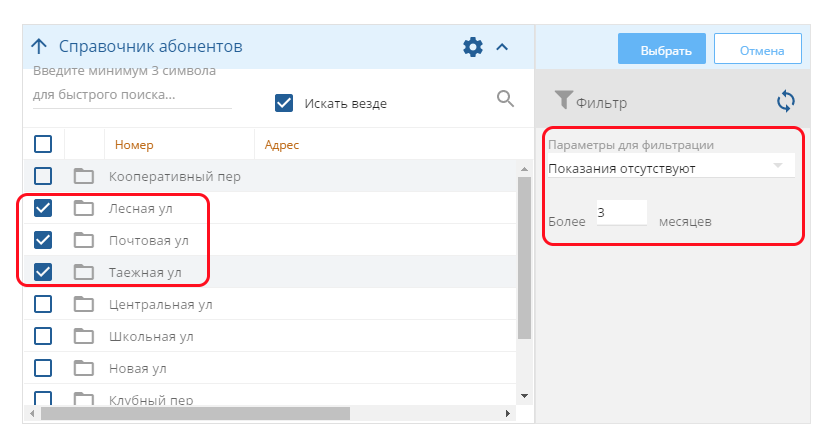

Ведомости обхода
================

Рассмотрим процесс формирования и заполнения ведомостей обхода. Выбираем рабочее место *Приборы учета*, интерфейс *Ведомости обхода*. Принцип организации хранения устанавливается пользователем. Создаются иерархические реестры ведомостей. Каталоги включают в себя подкаталоги или непосредственно ведомости обхода. Также реализовано деление на актуальные и обработанные ведомости. 

Руководитель отдела формирует ведомости обхода и задает маршрут для контролера, ответственного за определенные лицевые. Добавление новой ведомости осуществляется по кнопке *Добавить запись*. В новой ведомости заполняются поля: *Дата создания*, *Номер*, *Название*, *Показание за отчетный месяц*, *Примечание*.

 
Нажимаем кнопку *Сформировать ведомость по лицевым счетам*. Открывается диалоговое окно *Справочник абонентов*. Диалоговое окно условно разделено на 2 раздела. Слева располагается адресный список, в котором настроен быстрый поиск, аналогичный, описанному выше. В правой части настроен фильтр с параметрами для фильтрации:

* показания отсутствуют более _ месяцев;
* наличие задолженности более _ месяцев, более _ руб.;
* отсутствие контрольных обходов более _ месяцев.

 
Если наша цель – заполнить ведомость всеми лицевыми определенного одного МКД, то лучше воспользоваться выбором через адресный список, поставив галку, напротив выбранного объекта и нажать кнопку Выбрать, оставив пустым фильтр справа. Если мы хотим получить перечень лицевых с долгим отсутствием показаний, наличию задолженности или долгому отсутствию контрольных обходов, то логично отметить более крупные объекты адресного списка и использовать фильтрацию правой части окна.

 
После нажатия кнопки *Выбрать* формируется ведомость, которую можно распечатать по соответствующей кнопке. 

.. image:: ./Pictures/Lichny_kabinet_kontrolera_vedomosti_obxoda/4.png
 
После внесения всех показаний ведомость закрывается и попадает в *Обработанные ведомости*.
