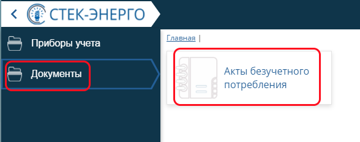
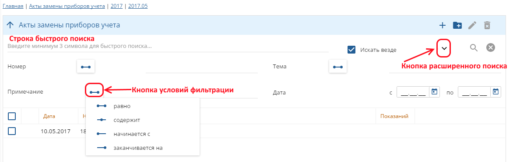
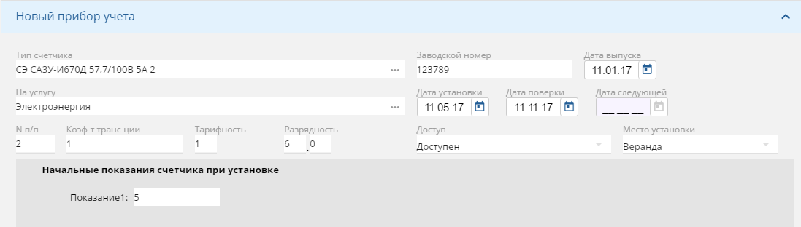

Введение
========
Вход в программу. В окне входа в программу требуется указать имя пользователя и соответствующий пароль.

 
В Личном кабинете контролера есть два рабочих места: *Приборы учета* и *Документы*.

.. image:: 2.png
 
На рабочем месте *Приборы учета* доступны интерфейсы: *Акты замены приборов учета* и *Ведомости обхода*. На интерфейсе *Акты замены приборов* ведется реестр ведомостей замены, установки и снятия ПУ. На интерфейсе *Ведомости обхода* формируются ведомости обхода для контролеров исходя из данных фильтрации по длительности непредставления показаний, величине задолженности и давности последнего показания, снятого контролером.

.. image:: 3.png

 
Рабочее место *Документы*  содержит интерфейс *Акты безучетного потребления*. На интерфейсе ведется учет нарушений эксплуатации счетчиков, незаконного потребления электроэнергии (бездоговорное и безучетное потребление), а также определяется объем и рассчитывается стоимость незаконно потребленной энергии.  

 
Акты замены приборов учета
==========================
На интерфейсе *Акты замены приборов учета* в иерархическом порядке располагаются реестры ведомостей замены ПУ, в виде каталогов  с делением по годам, месяцам, районам, улицам  и т.д. Выбор организации хранения данных устанавливается пользователем. В каталогах находятся ведомости замены ПУ. Добавление реестров ведомостей, отдельных ведомостей, редактирование и удаление производится соответствующими кнопками на верхней рабочей панели интерфейса.

.. image:: 5.png
 
В программе реализована возможность быстрого поиска по минимум трем введенным символам, а также функция расширенного поиска по кнопке со стрелкой вниз. Расширенный поиск ведется в разрезах номера, темы, примечаний, даты. Для поиска по номеру, теме и примечанию следует воспользоваться кнопкой условий фильтрации.

 
Создадим новую ведомость по кнопке *Добавить запись* и заполним поля: *Дата создания ведомости*, ее порядковый *Номер* (проставляется автоматически), *Тема*, *Расчетный месяц* и *Наименование ведомости*.

.. image:: 7.png
 
Рассмотрим процесс создания акта замены ПУ в ведомости. Создадим новый акт по кнопке *Добавить запись*. Выберем нужный лицевой счет из адресного списка по кнопке *Выбора записи*. Поле *Адрес* заполняется автоматически.

 
Выберем тип акта, например, *Замена прибора учета*.

.. image:: 9.png
 
Выберем счетчик, подлежащий замене на лицевом счете, заполним поля *Дата* и *Причина снятия*.

 
Далее вносим новое *Показание счетчика* и *Дополнительный расход* (при его наличии). Поля *Расход* и *Итого* заполняются автоматически.

 
Вносим данные по новому счетчику. Тип счетчика, на какую он услугу, его заводской номер и дату выпуска, технические характеристики счетчика, а также дату установки и поверки,  информацию о месте установки и возможности доступа. Важно внести начальные показания счетчика при установке, иначе они автоматически будут приравнены к нулю.

 
Вносим информацию о пломбах. Обязательными для заполнения полями являются *Дата установки* и *Последняя поверка*, причем дата установки пломбы обязательно следует не ранее даты установки счетчика.

 
Проверяем корректность всех внесенных данных и нажимаем на кнопку *Заменить* в нижнем левом углу. В итоге в ведомости отражается снятие старого счетчика и установка нового. Аналогичные действия выполняются для типов актов *Снятие прибора учета* и *Установка прибора учета*.

.. image:: 14.png
 
При входе на карточку лицевого счета видим отразившиеся изменения.

 
Ведомости обхода
================

Рассмотрим процесс формирования и заполнения ведомостей обхода. Выбираем рабочее место *Приборы учета*, интерфейс *Ведомости обхода*. Принцип организации хранения устанавливается пользователем. Создаются иерархические реестры ведомостей. Каталоги включают в себя подкаталоги или непосредственно ведомости обхода. Также реализовано деление на актуальные и обработанные ведомости. 

Руководитель отдела формирует ведомости обхода и задает маршрут для контролера, ответственного за определенные лицевые. Добавление новой ведомости осуществляется по кнопке *Добавить запись*. В новой ведомости заполняются поля: *Дата создания*, *Номер*, *Название*, *Показание за отчетный месяц*, *Примечание*.

 
Нажимаем кнопку *Сформировать ведомость по лицевым счетам*. Открывается диалоговое окно *Справочник абонентов*. Диалоговое окно условно разделено на 2 раздела. Слева располагается адресный список, в котором настроен быстрый поиск, аналогичный, описанному выше. В правой части настроен фильтр с параметрами для фильтрации:

* показания отсутствуют более _ месяцев;
* наличие задолженности более _ месяцев, более _ руб.;
* отсутствие контрольных обходов более _ месяцев.

.. image:: 17.png
 
Если наша цель – заполнить ведомость всеми лицевыми определенного одного МКД, то лучше воспользоваться выбором через адресный список, поставив галку, напротив выбранного объекта и нажать кнопку Выбрать, оставив пустым фильтр справа. Если мы хотим получить перечень лицевых с долгим отсутствием показаний, наличию задолженности или долгому отсутствию контрольных обходов, то логично отметить более крупные объекты адресного списка и использовать фильтрацию правой части окна.

 
После нажатия кнопки *Выбрать* формируется ведомость, которую можно распечатать по соответствующей кнопке. 

 
После внесения всех показаний ведомость закрывается и попадает в *Обработанные ведомости*.

